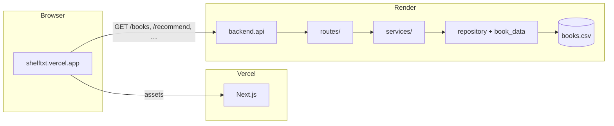
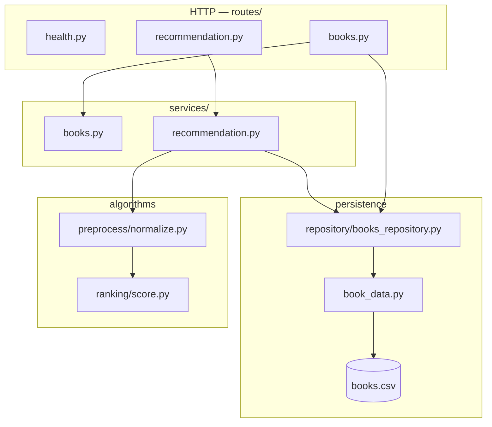

# Architecture

> **Folder guide:** [architecture/system-overview.md](architecture/system-overview.md) — responsibilities per directory.

## System context

Shelftxt is a **monorepo monolith**: one codebase, three runnable surfaces, two production hosts.

| Surface | Stack | Host (production) | Entry |
|---------|-------|-------------------|-------|
| Web UI | Next.js 16 (App Router) | [Vercel](https://shelftxt.vercel.app) | `frontend/app/page.tsx` |
| REST API | FastAPI + pandas | [Render](https://shelftxt.onrender.com) | `backend/api.py` |
| Batch pipeline | Python (CLI / scripts) | Local only | `backend/ingest/pipeline.py` |
| CLI | Python stdin menu | Local only | `cli/manage_books.py` |

Persistent app state is a single CSV: `backend/data/processed/books.csv`, accessed through `backend/book_data.py` and `backend/repository/books_repository.py`.

---

## Production topology



**Production:** Browser → Render directly (`frontend/lib/apiUrl.ts`).  
**Local dev:** Browser → `/api/*` → Next.js route handlers → `127.0.0.1:8000`. See [decisions.md](decisions.md#adr-003-production-api-calls-bypass-vercel-proxy).

---

## Repository layout

```txt
shelftxt/
├── backend/
│   ├── api.py                 # FastAPI app: CORS, lifespan, register routers
│   ├── book_data.py           # CSV I/O implementation
│   ├── repository/
│   │   └── books_repository.py   # Thin wrapper over book_data
│   ├── routes/
│   │   ├── health.py          # GET /, GET|HEAD /health
│   │   ├── books.py           # /books, /books/import, /books/remove
│   │   └── recommendation.py  # GET /recommend, POST /recommend/refresh
│   ├── schemas/
│   │   └── books.py           # Pydantic request bodies
│   ├── services/
│   │   ├── books.py           # delete_book_by_title, parse_date_or_today
│   │   └── recommendation.py  # get_recommendation (+ LRU cache)
│   ├── preprocess/
│   ├── ranking/
│   ├── ingest/
│   └── data/
├── frontend/
├── cli/
├── tests/
├── api.py                     # Shim: uvicorn api:app → backend.api
├── requirements.txt
└── Procfile
```

Run from **repo root**:

```bash
uvicorn backend.api:app --reload
python -m unittest discover -s tests -v
```

---

## Backend request flow



| Layer | Module | Responsibility |
|-------|--------|----------------|
| **App** | `api.py` | Create `FastAPI`, CORS, keep-warm scheduler, `include_router()` |
| **Routes** | `routes/*.py` | HTTP methods, call services, return responses |
| **Schemas** | `schemas/books.py` | Pydantic validation for request bodies |
| **Services** | `services/*.py` | Use-cases and orchestration |
| **Repository** | `repository/books_repository.py` | `get_all_books()`, `save_books()` — delegates to `book_data` |
| **Persistence** | `book_data.py` | CSV path, columns, load/save coercion |
| **Algorithms** | `preprocess/`, `ranking/` | Normalization and scoring (no HTTP, no I/O) |

### Route map

| Router file | Paths |
|-------------|-------|
| `routes/health.py` | `GET /`, `GET|HEAD /health` |
| `routes/books.py` | `GET|POST|PATCH|DELETE /books`, `POST /books/remove`, `POST /books/import` |
| `routes/recommendation.py` | `GET /recommend`, `POST /recommend/refresh` |

Shelf PATCH logic (want / reading / read / dnf) remains in `routes/books.py` for now; delete uses `services/books.delete_book_by_title`.

---

## Two data paths

### App path (UI + API + CLI)

- **Schema:** Goodreads-style columns — [data-model.md](data-model.md).
- **Persistence:** `book_data.load_data()` / `save_data()` (via repository in new code paths).
- **Ranking:** `GET /recommend` → `services/recommendation.get_recommendation()`; scores not stored in CSV.
- **UI import:** Client CSV → `POST /books/import` (not the batch pipeline).

### Batch path

- **Schema:** Canonical lowercase fields.
- **Entry:** `backend/ingest/pipeline.py` — see [pipeline.md](pipeline.md).

---

## Frontend

| Module | Role |
|--------|------|
| `lib/apiUrl.ts` | Production browser → Render |
| `lib/backendUrl.ts` | Dev Next.js proxy target |
| `app/api/*/route.ts` | Dev-only same-origin proxy |

Details: [frontend.md](frontend.md).

---

## Cross-cutting concerns

| Concern | Where |
|---------|--------|
| CORS | `backend/api.py` |
| JSON NaN → null | `routes/books.clean_for_json`, `services/recommendation.clean_for_json` |
| Title as key | PATCH/DELETE by `Title` — [decisions.md](decisions.md#adr-004-title-string-as-primary-key) |
| Recommendation cache | `@lru_cache` on `get_recommendation`; clear via `POST /recommend/refresh` |
| Keep-warm | `AsyncIOScheduler` → `GET /health` every 14 min |
| Legacy monolith | `backend/api_draft.py` — superseded by `backend/api.py`; do not use for new work |

---

## Testing

| File | What it exercises |
|------|-------------------|
| `tests/test_api.py` | HTTP via `TestClient(backend.api.app)`; mock at route or `book_data` layer |
| `tests/test_flexible_pipeline.py` | Ingest + ranking pipeline |

When mocking after the refactor, patch where names are **used** (e.g. `backend.routes.books.load_data`, `backend.services.recommendation.get_recommendation`).

---

## Related docs

- [api.md](api.md) — REST reference
- [deployment.md](deployment.md) — Render + Vercel
- [decisions.md](decisions.md) — ADRs
- [contributing.md](contributing.md) — layer rules
