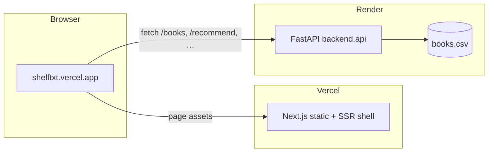
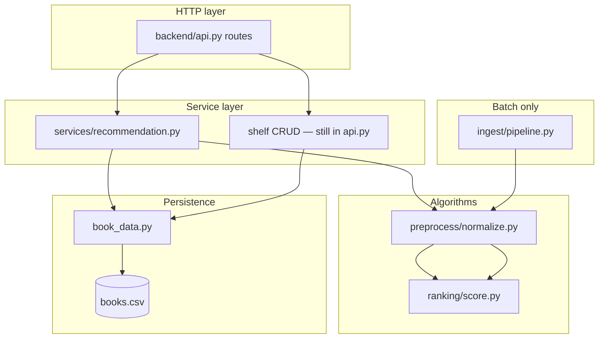

# Architecture

## System context

Shelftxt (LibroRank) is a **monorepo monolith**: one codebase, three runnable surfaces, two production hosts.

| Surface | Stack | Host (production) | Entry |
|---------|-------|-------------------|-------|
| Web UI | Next.js 16 (App Router) | [Vercel](https://shelftxt.vercel.app) | `frontend/app/page.tsx` |
| REST API | FastAPI + pandas | [Render](https://shelftxt.onrender.com) | `backend/api.py` |
| Batch pipeline | Python (CLI / scripts) | Local only | `backend/ingest/pipeline.py` |
| CLI | Python stdin menu | Local only | `cli/manage_books.py` |

Persistent app state is a single CSV: `backend/data/processed/books.csv`, owned by `backend/book_data.py`.

---

## Production topology



**Important:** In production the browser calls **Render directly** (`https://shelftxt.onrender.com/...`), not Vercel `/api/*`. See [decisions.md](decisions.md#adr-003-production-api-calls-bypass-vercel-proxy).

Local dev still uses Next.js route handlers as a same-origin proxy (`/api/*` → `127.0.0.1:8000`).

---

## Repository layout

```txt
shelftxt/
├── backend/                 # Python application package
│   ├── api.py               # FastAPI app, routes, schemas (transitional)
│   ├── book_data.py         # CSV persistence (“repository”)
│   ├── services/            # Business orchestration
│   │   └── recommendation.py
│   ├── routes/              # Reserved — split from api.py later
│   ├── schemas/             # Reserved — Pydantic models later
│   ├── preprocess/          # Normalization for ranking
│   ├── ranking/             # Scoring algorithms
│   ├── ingest/              # Batch CSV pipeline
│   └── data/
│       ├── processed/       # Live library (gitignored)
│       └── raw/             # Optional staging
├── frontend/                # Next.js UI
├── cli/                     # Interactive shelf helper
├── tests/                   # Python unit tests
├── docs/                    # Technical documentation
├── api.py                   # Legacy ASGI shim: uvicorn api:app
├── requirements.txt         # Python deps (repo root — required for Render)
├── Procfile                 # Render start command
└── render.yaml              # Optional Render Blueprint
```

Run Python from **repo root** so `backend` resolves as a package:

```bash
uvicorn backend.api:app --reload
python -m unittest discover -s tests -v
python -m cli.manage_books
```

---

## Backend layers (target model)

Refactor is incremental. Today most HTTP logic still lives in `backend/api.py`; recommendation is extracted.



| Layer | Responsibility | Rule |
|-------|----------------|------|
| **Routes** (`api.py`) | HTTP, status codes, validation, call services | No ranking math, no raw pandas shelf rules long-term |
| **Services** | Use-cases: “recommend one book”, “move to read” | Orchestrate repo + algorithms; no FastAPI imports |
| **Repository** (`book_data.py`) | Load/save CSV, column coercion | No shelf business rules |
| **Algorithms** (`preprocess/`, `ranking/`) | Pure transforms and scoring | No HTTP, no file I/O |
| **Ingest** (`ingest/`) | Arbitrary CSV → canonical schema | Separate from live app CSV path |

---

## Two data paths

### App path (UI + API + CLI)

- **Schema:** Goodreads-style columns (`Title`, `Authors`, `Read Status`, …). See [data-model.md](data-model.md).
- **Read/write:** `book_data.load_data()` / `save_data()`.
- **Ranking:** On demand in `GET /recommend` via `services/recommendation.py`; scores are **not** persisted to CSV.
- **Import (UI):** Browser parses CSV → `POST /books/import` JSON — does **not** use the flexible ingest pipeline.

### Batch path (flexible pipeline)

- **Schema:** Canonical lowercase fields (`title`, `author`, `read_status`, …).
- **Input:** User CSV + JSON mapping config.
- **Output:** In-memory ranked DataFrames; **not** auto-merged into `books.csv`.

Both paths share `preprocess/normalize.py` and `ranking/score.py`. Column resolution accepts app and canonical names via `_resolve_column()`.

Details: [pipeline.md](pipeline.md).

---

## Frontend architecture

Single client page (`frontend/app/page.tsx`) with three tabs: Library, Import, Discover.

| Concern | Module |
|---------|--------|
| Production API URL | `frontend/lib/apiUrl.ts` — browser → Render |
| Dev proxy target | `frontend/lib/backendUrl.ts` — Next route handlers → backend |
| Upstream errors | `frontend/lib/upstreamError.ts` |

Next.js `app/api/*/route.ts` handlers remain for **local development** (avoids CORS). Production uses direct fetch; backend CORS must allow `https://shelftxt.vercel.app`.

Details: [frontend.md](frontend.md).

---

## Cross-cutting concerns

| Concern | Implementation |
|---------|----------------|
| **CORS** | `backend/api.py` — `localhost:3000`, `127.0.0.1:3000`, `shelftxt.onrender.com`, `shelftxt.vercel.app` |
| **JSON safety** | `clean_for_json()` — NaN → `null` before DataFrame serialization |
| **Title as key** | Updates/deletes match `Title` string equality; rename checks duplicates |
| **Keep-warm** | `AsyncIOScheduler` pings `/health` every 14 min (Render free tier) |
| **Legacy entrypoint** | Root `api.py` re-exports app for `uvicorn api:app` |

---

## Testing strategy

| Suite | Scope |
|-------|--------|
| `tests/test_api.py` | HTTP contracts; persistence mocked at `backend.api` |
| `tests/test_flexible_pipeline.py` | Ingest mapping, validation, ranking integration |

No frontend automated tests yet. Manual smoke: library load, add book, recommend.

---

## Related docs

- [deployment.md](deployment.md) — Render + Vercel runbook
- [decisions.md](decisions.md) — Architecture decision records
- [troubleshooting.md](troubleshooting.md) — Common failures
- [contributing.md](contributing.md) — Conventions and PR checklist
- [api.md](api.md) — REST reference
