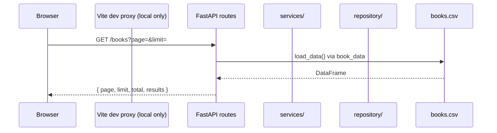
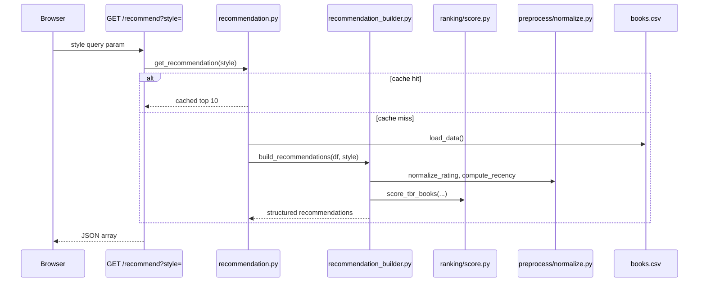
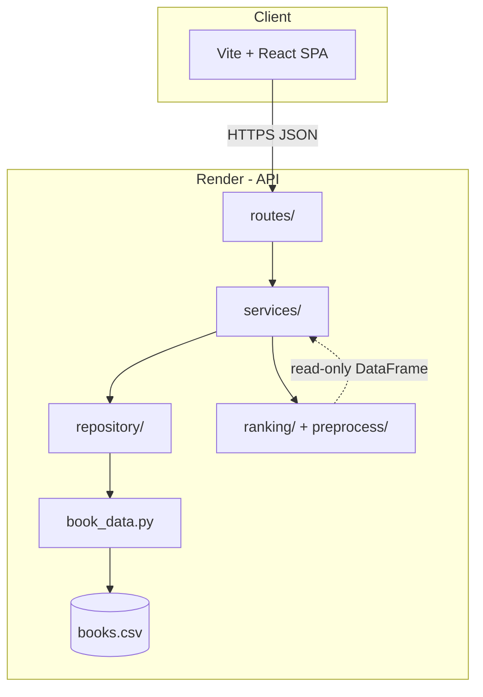

# Architecture

## High-level summary

ShelfTxt is a **monorepo** with three runnable surfaces that share one logical library:

| Surface | Stack | Role |
|---------|-------|------|
| **Web UI** | Vite, React 19, TypeScript, Tailwind CSS | Reader-facing library, progress, recommendations, settings |
| **REST API** | FastAPI, pandas, Pydantic | CRUD, import/export, recommendation orchestration |
| **CLI** | Python (`cli/manage_books.py`) | Local shelf edits (limited commands today) |
| **Batch pipeline** | Python (`backend/ingest/`) | Offline CSV mapping to canonical schema—not used by live UI import |

**Persistence today:** a single CSV file at `backend/data/processed/books.csv`, accessed through `backend/book_data.py` and wrapped by `backend/repository/books_repository.py`.

**Production hosts (as of current deployment):**

- Frontend: Vercel (`shelftxt.vercel.app`)
- API: Render (`shelftxt.onrender.com`)

---

## Production topology


- **Production:** browser calls Render directly (`frontend/src/lib/api.ts`).
- **Local dev:** browser calls `/api/*` → Vite proxy → `127.0.0.1:8000`.

See [decisions.md](../product/decisions.md#adr-003-production-api-calls-bypass-vercel-proxy).

---

## Main components

### Frontend

- SPA under `frontend/src/`
- Routes: Dashboard, Library, Recommendations, Book detail, Add book, Insights, Settings
- Calls the API via `frontend/src/lib/api.ts` (direct to Render in production; Vite proxy `/api/*` in local dev)
- Reader preferences (recommendation style, theme, accent) stored in **browser `localStorage`** — not synced to the backend today

### FastAPI backend

- Entry: `backend/api.py` — CORS, lifespan (keep-warm ping), router registration
- HTTP handlers: `backend/routes/` — thin; delegate to services
- Business logic: `backend/services/` — shelf mutations, import/export, recommendation cache
- Validation: `backend/schemas/` — Pydantic request bodies

### Book data storage layer

- `backend/book_data.py` — load/save CSV, column normalization on read
- `backend/repository/books_repository.py` — thin facade (`get_all_books`, `save_books`) intended for future DB swap

### Recommendation / ranking logic

- **Preprocess:** `backend/preprocess/normalize.py` — `rating_norm`, `recency_norm`
- **Ranking:** `backend/ranking/score.py` — TBR scoring via author preference from read history
- **Orchestration:** `backend/services/recommendation_builder.py` — top-N list, explanations, similar books
- **Cache:** `backend/services/recommendation.py` — `@lru_cache` keyed by recommendation style

Ranking modules perform **no I/O**; they receive DataFrames from services.

### CSV import / export

- **UI import:** browser parses CSV → JSON → `POST /books/import`
- **Export:** `GET /books/export` returns full library CSV
- **Batch ingest:** separate Python pipeline for arbitrary external CSV schemas — see [import-export.md](import-export.md#batch-pipeline)

---

## Request / response flow (typical read)



## Request / response flow (recommendation)



Mutations (add, patch, progress, delete, import, clear) go through `services/books.py`, persist via repository, then call `invalidate_recommendation_cache()`.

---

## System context diagram



---

## Layer boundaries

| Layer | Responsibility | Should not |
|-------|----------------|------------|
| **UI** | Display library, collect edits, explain recommendations to readers | Implement scoring rules or persist data locally (except UI-only prefs) |
| **Routes** | HTTP mapping, status codes, JSON/CSV response shapes | Contain shelf transition branching or ranking math |
| **Services** | Use cases: add book, update progress, build recommendations | Know about React or Vite |
| **Repository** | Load/save abstraction | Rank or validate HTTP bodies |
| **book_data** | CSV file I/O, column repair | Business rules for shelf states |
| **ranking / preprocess** | Pure transforms on DataFrames | Read files or call HTTP |

### Known boundary gaps (current)

- `GET /books` loads the full CSV via `load_data()` in the route, then slices for `page`/`limit` — wire-level pagination only until PostgreSQL; repository use remains a minor inconsistency.
- `backend/api_draft.py` exists as legacy reference; **not** mounted by `uvicorn backend.api:app`.
- Title remains a lookup key for `PATCH /books` and `DELETE /books?title=`; book id (`ISBN/UID`) is preferred for progress and delete-by-id from the UI.

---

## Two data paths

| Path | Schema | Entry |
|------|--------|-------|
| **App (live)** | `BOOKS_COLUMNS` in CSV | UI, API, CLI |
| **Batch (offline)** | Canonical lowercase fields | `backend/ingest/pipeline.py` |

UI import uses `POST /books/import` (JSON)—not the batch pipeline. See [import-export.md](import-export.md).

---

## Route map (current)

| Router | Paths |
|--------|-------|
| `health.py` | `GET|HEAD /health` |
| `books.py` | `GET /books?page&limit` (paginated), `POST|PATCH|DELETE /books`, `GET /books/export`, `POST /books/import`, `POST /books/clear`, `PATCH /books/{id}/progress`, `DELETE /books/{id}` |
| `recommendation.py` | `GET /recommend?style=` |

Full API reference: [api.md](api.md).

---

## Cross-cutting concerns

| Concern | Location |
|---------|----------|
| CORS | `backend/api.py` |
| Recommendation cache | `@lru_cache` in `services/recommendation.py`; cleared on book writes |
| Keep-warm | Scheduler pings `/health` every 14 min |
| Legacy | `backend/api_draft.py` — not loaded in production |

---

## Repository map

Where code lives and what each layer may do.

### Top level

```text
shelftxt/
├── backend/       # FastAPI, ranking, CSV persistence
├── frontend/        # Vite + React SPA (Vercel)
├── cli/             # Local shelf helper
├── tests/           # Python unit tests
└── docs/            # This documentation
```

### `backend/`

| Path | Responsibility |
|------|----------------|
| `api.py` | FastAPI app, CORS, keep-warm job, router registration |
| `routes/` | HTTP handlers — call services, return JSON/CSV |
| `schemas/` | Pydantic request models |
| `services/` | Use cases: books CRUD, import/export, recommendations |
| `services/recommendation_builder.py` | Top-10 recommendations + explanations |
| `services/book_api.py` | Row → API book dict; lookup by `ISBN/UID` |
| `repository/` | `get_all_books`, `save_books` → `book_data.py` |
| `book_data.py` | CSV path, columns, load/save coercion |
| `preprocess/` | `rating_norm`, `recency_norm` |
| `ranking/` | `score_tbr_books`, `score_read_books` |
| `ingest/` | Offline batch pipeline (not live UI import) |
| `data/processed/` | Runtime `books.csv` (gitignored) |

#### Layer rules {#backend-layer-rules}

```text
routes/  →  services/  →  repository/  →  book_data.py  →  CSV
                ↘  preprocess/ , ranking/  (algorithms only)
```

| Layer | Do | Don't |
|-------|-----|--------|
| `routes/` | HTTP, delegate to services | Shelf algorithms, long CSV rules |
| `services/` | Orchestration, business validation | FastAPI route definitions |
| `repository/` | Load/save abstraction | Ranking math |
| `ranking/` | Pure DataFrame transforms | File I/O |

Always import with the `backend.` package prefix from repo root.

### `backend/routes/` (current)

| File | Paths |
|------|-------|
| `health.py` | `/health` |
| `books.py` | `GET /books?page&limit` (paginated), `/books/export`, `/books/import`, `/books/clear`, `/books/{id}/progress`, `/books/{id}` |
| `recommendation.py` | `/recommend` |

Most shelf logic lives in `services/books.py`. `GET /books` paginates in the route after `load_data()` (full CSV read until Postgres).

### `frontend/`

| Area | Role |
|------|------|
| `src/pages/` | Route screens (Dashboard, Library, Recommendations, …) |
| `src/features/` | Domain UI (dashboard, recommendations, settings) |
| `src/components/` | Shared layout and book editors |
| `src/lib/api.ts` | `apiUrl`, `fetchJson` |
| `src/lib/userSettings.ts` | Theme, accent, recommendation style (localStorage) |
| `src/contexts/` | `UserSettingsProvider` |

Deployed as a static SPA on Vercel (`frontend/dist/`). Details: [frontend.md](frontend.md).

### Tests

```bash
./.venv/bin/python -m unittest discover -s tests -v
```

| File | Covers |
|------|--------|
| `test_api.py` | HTTP via `TestClient`; `GET /books` pagination + mock services/repository |
| `test_recommendation_builder.py` | Structured recommendation output |
| `test_flexible_pipeline.py` | Batch ingest + ranking |

Patch names **where they are used** in the module under test.

---

## Where to change things

| Question | Look in |
|----------|---------|
| API path or status code | `backend/routes/` |
| Scoring or explanation text | `ranking/`, `services/recommendation_builder.py` |
| CSV columns | `backend/book_data.py` |
| UI route or flow | `frontend/src/pages/` |
| Deploy / env | [deployment.md](deployment.md) |
| Past refactors | [devlogs/](../history/devlogs) |

---

## Deployment notes

See [deployment.md](deployment.md). Render runs a periodic self-ping to `/health` to reduce cold starts on free tier. CSV on Render filesystem may not survive redeploys—documented as an operational limitation in [scalability.md](scalability.md).

---

## Refactor backlog

| Area | Status |
|------|--------|
| Layered routes + services | Mostly done |
| `GET /books` via repository; server-side CSV paging | Minor gap |
| Remove `api_draft.py` | Pending |
| Postgres migration | Planned — [ROADMAP.md](../../ROADMAP.md) |

---

## Related

- [data-model.md](data-model.md) — CSV columns
- [backend.md](backend.md) — routes, services, sequence diagrams
- [deployment.md](deployment.md) — production runbook
- [recommendation-system.md](recommendation-system.md) — scoring and explanations
