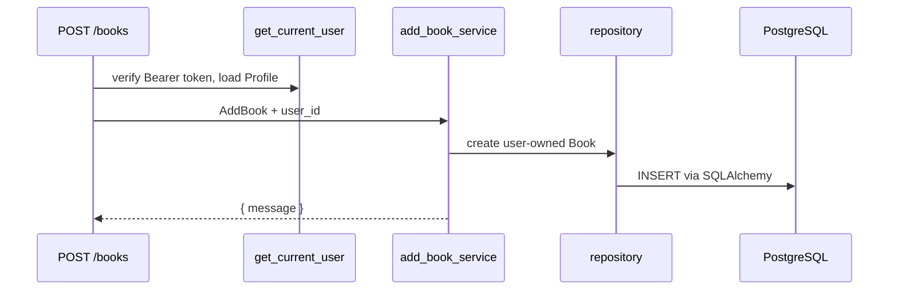
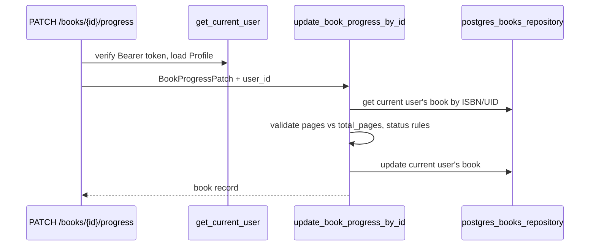
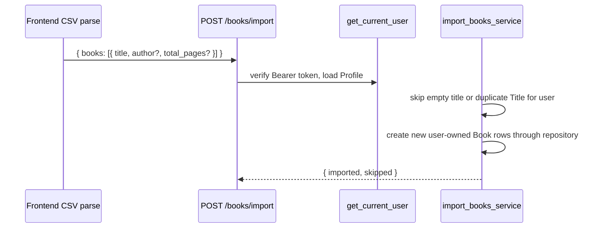
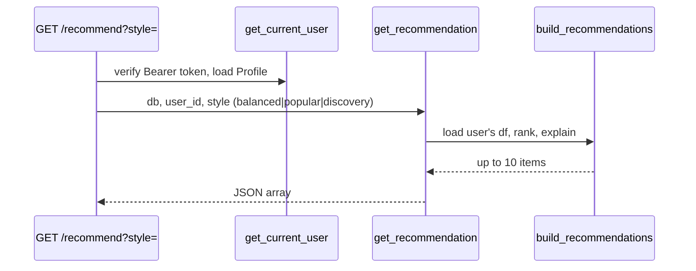

# Backend

## Folder structure (backend/)

```text
backend/
├── api.py                 # FastAPI app, CORS, lifespan, router includes
├── auth/
│   └── dependencies.py    # Supabase Bearer token verification
├── book_data.py           # Legacy CSV helpers, BOOKS_COLUMNS
├── db/
│   ├── database.py        # SQLAlchemy engine, SessionLocal, get_db
│   └── models.py          # Profile and Book ORM models
├── routes/
│   ├── health.py          # GET/HEAD /health
│   ├── books.py           # /books, import, export, clear, progress, delete by id
│   ├── metadata.py        # Explicit user-triggered metadata generation status/start
│   └── recommendation.py  # GET /recommend
├── schemas/
│   └── books.py           # Pydantic request bodies + BooksPage (GET /books)
├── services/
│   ├── books.py           # Shelf CRUD, import/export/clear, progress updates
│   ├── postgres_books.py  # User-scoped PostgreSQL book services
│   ├── book_api.py        # Row → API book dict, find by ISBN/UID
│   ├── recommendation.py  # User-scoped recommendation orchestration
│   └── recommendation_builder.py  # Top-N + explanations + similar books
├── repository/
│   ├── books_repository.py
│   └── postgres_books_repository.py  # PostgreSQL CRUD repository
├── preprocess/
│   └── normalize.py       # rating_norm, recency_norm
├── ranking/
│   └── score.py           # score_tbr_books, score_read_books, recommend_one
└── ingest/                # Offline batch pipeline (not live UI import)
```

---

## Responsibilities by layer

### API routes (`backend/routes/`)

- Map HTTP verbs and paths to service functions
- Require the current Supabase profile for book and recommendation routes
- Serialize responses (paginated JSON, recommendation arrays, CSV download, `NaN` → `null` for JSON)
- Stay thin: no shelf state machines, no scoring formulas
- User-facing endpoints must never do external enrichment or long-running work. Enrichment belongs to explicit background jobs or CLI scripts such as `python -m backend.scripts.backfill_book_metadata`.

**Example:** `PATCH /books/{book_id}/progress` validates body via Pydantic, calls `update_book_progress_by_id`.

### Performance and background-work rule

User-facing backend endpoints must be light, fast, scoped, and DB-only unless explicitly documented otherwise.

The normal UI paths `GET /books`, `GET /recommend`, book add/edit/delete, clear, import, and any future dashboard/page-supporting route must not call Open Library, Google Books, metadata enrichment, page-count lookup, recommendation backfill, or other external APIs. They should read/write only the authenticated user's rows and return promptly.

Heavy work belongs to explicit CLI scripts, user-triggered metadata jobs, or future background jobs. It must not block a response, delay page loads, make the UI wait, or fail the user request if enrichment fails. Automatic startup backfills, import backfills, and page-load enrichment are not allowed.

Metadata generation is an explicit workflow:

- `GET /metadata/status` reports current-user genre coverage and latest job progress.
- `POST /metadata/generate` creates a current-user metadata job and returns status immediately.
- The job may call Open Library/Google Books through metadata lookup code, but only after the explicit user action and outside normal page/import/recommend flows.

If ShelfTxt adds a search index table or external search document store, delete paths must immediately remove or mark current-user entries hidden/deleted in the same user action. Physical cleanup can run later, but deleted books must not remain visible in search results. The current backend has no dedicated search index table.

### Services (`backend/services/`)

- Own business rules: shelf transitions, progress validation, duplicate skipping on import
- Call repository for persistence
- Pass authenticated `user_id` through book CRUD and recommendation flows
- Compose ranking/preprocess for recommendations

### Schemas (`backend/schemas/`)

- Request validation at the HTTP boundary
- Models today: `AddBook`, `PatchBook`, `ImportBooks`, `BookProgressPatch`, `ClearLibraryRequest`

Book-related schemas include stronger request validation, response models, pagination metadata constraints, and ORM compatibility via `ConfigDict(from_attributes=True)`.

### Repository / data access

- `postgres_books_repository.py`: `get_all_books()`, `get_book_by_id()`, `get_book_by_isbn_uid()`, `create_book()`, `update_book()`, `delete_book()`
- Underlying I/O: SQLAlchemy session operations against PostgreSQL
- Book CRUD route flow: auth dependency → route → service → repository → SQLAlchemy → PostgreSQL
- `books_repository.py` and `book_data.py` remain for legacy CSV-adjacent paths.

### Ranking / recommendation modules

- **Pure functions** on pandas DataFrames
- `score_tbr_books` — ranks `to-read` rows using author preference from `read` rows
- `score_read_books` — ranks finished books (used in batch pipeline; not primary HTTP path today)
- `recommendation_builder.build_recommendations` — HTTP-facing structured output

---

## Why business logic stays out of route handlers

1. **Testability** — services are unit-tested without forcing shelf rules into HTTP handlers.
2. **Reuse** — CLI and future jobs can call the same functions as the API.
3. **Ownership** — one place passes the authenticated profile id into persistence calls.
4. **Evolution** — database changes are isolated behind repository + services instead of every route.

Route handlers should read like: validate input → call service → return result.

---

## Flows

### Add book



### Update progress (UI primary path)



Status mapping in API responses preserves the existing public shape while storing PostgreSQL `read_status`, page, progress, rating, and date fields on the `Book` model.

### Patch shelf (legacy / advanced)

`PATCH /books` with `move_to`: `want` | `reading` | `read` | `dnf` — keyed by **title** within the authenticated user's library. Still supported; UI primarily uses progress endpoint for status.

### Import books



### Export library

`GET /books/export` → `export_library_csv(db, user_id)` → raw CSV string for the authenticated user's library with `Content-Disposition` attachment.

### Clear library

`POST /books/clear` with `{ "confirm": true }` → delete current user's PostgreSQL book rows.

### Delete book

- `DELETE /books/{book_id}` — used by UI (`ISBN/UID`)
- `DELETE /books?title=` — title query param (legacy)

### Recommendations



---

## Error handling conventions

- **404** — book not found (title or id)
- **401** — missing, invalid, expired, or profile-less Supabase token
- **400** — validation failures (progress exceeds total pages, clear without confirm, read without rating on legacy patch, etc.)
- FastAPI/Pydantic **422** — malformed JSON or invalid enum values on request bodies

Errors typically return `{ "detail": "message" }`. Frontend `fetchJson` surfaces `detail` to the user when present.

---

## Legacy and to confirm

| Item | Status |
|------|--------|
| `backend/api_draft.py` | Legacy monolith; not loaded in production |
| `recommend_one()` in `score.py` | Used in older single-pick flow; HTTP now uses top-10 builder |
| Genre in app model | Not in the live `Book` model; batch pipeline supports genre separately |
