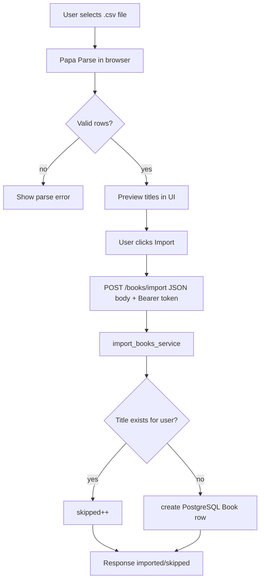
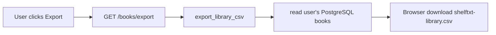

# Import and export flow

ShelfTxt uses PostgreSQL as the primary storage backend for user-owned libraries. It still supports two related but **separate** CSV compatibility paths:

1. **Live UI import / API export** — what readers use in Settings
2. **Batch ingest pipeline** — developer/offline tool for foreign CSV schemas

This document covers **(1)** in depth and references **(2)** where it diverges.

---

## CSV import (UI + API)

### Purpose

Bulk add books to the TBR shelf without manual entry—typical after exporting from a spreadsheet or another tool (with compatible columns).

Live import is authenticated. The frontend sends `Authorization: Bearer <supabase_access_token>`, and imported rows are created for the signed-in user only.

### Flow



### Expected CSV fields (UI parser)

The frontend accepts flexible header names:

| Logical field | Accepted headers |
|---------------|------------------|
| Title | `title`, `Title` |
| Author | `author`, `Author` |
| Total pages | `total_pages`, `Total Pages` |

**Minimum:** at least one row with a non-empty title.

Optional fields in the file beyond these three are **ignored** by UI import.

### API request shape

After client parsing:

```json
{
  "books": [
    { "title": "Dune", "author": "Frank Herbert", "total_pages": 688 }
  ]
}
```

### Server behavior (`import_books_service`)

For each row:

1. Strip title; skip if empty → `skipped`
2. Skip if `Title` already in the signed-in user's library (case-sensitive) → `skipped`
3. Create a PostgreSQL row:
   - `user_id` = authenticated profile id
   - `Read Status` = `to-read`
   - `Progress (%)` = 0, `Pages Read` = 0
   - `ISBN/UID` = generated unique id
   - `Authors` = provided or `"Unknown"`
   - `Star Rating`, `Last Date Read` = empty

### Response

```json
{ "imported": 5, "skipped": 2 }
```

---

## CSV export

### Purpose

Backup, migration, editing in Excel/Sheets, or re-import elsewhere.

Export is authenticated and includes only the signed-in user's library.

### Flow



### Exported fields

Export uses the CSV-compatible public fields:

`Title`, `Authors`, `ISBN/UID`, `Read Status`, `Star Rating`, `Last Date Read`, `Progress (%)`, `Pages Read`, `Total Pages`

Export includes the signed-in user's **full library state**, not only TBR.

---

## Validation and cleanup

| Stage | Behavior |
|-------|----------|
| Client parse | Papa Parse errors surfaced in Settings UI |
| Client normalize | Invalid/missing pages → `null`; skip rows without title |
| Server import | Pydantic validates JSON shape; per-row skip logic |
| Server export | PostgreSQL rows are serialized to CSV-compatible field names |

Invalid star ratings in a hand-edited CSV should be corrected before import. Recommendation-adjacent CSV helpers may still coerce legacy CSV values when those paths are used.

---

## Handling missing or invalid fields

| Field missing on import | Result |
|-------------------------|--------|
| title | Row skipped (client) or skipped (server if empty) |
| author | `"Unknown"` |
| total_pages | `null` — user must set before progress tracking |

| Field missing on export row | Result |
|-----------------------------|--------|
| Any column | Still present in header; value empty/null |

---

## Backward compatibility

- Export → edit → re-import: **duplicate titles skipped**, not updated. Re-import is additive only.
- To “update” existing rows, use UI progress editor or `PATCH` endpoints—not import.
- Preserving `ISBN/UID` on re-import is **not** supported through UI import (new ids assigned for new titles only).
- Batch pipeline can map `Genre` and other fields into canonical form but does not automatically merge into PostgreSQL storage unless operated separately ([batch pipeline](#batch-pipeline)).

---

## Clear library (related)

`POST /books/clear` with confirm deletes the signed-in user's PostgreSQL book rows. Distinct from export; irreversible without a backup file.

---

## Batch pipeline

Batch ingestion for arbitrary user CSV schemas. Used from Python (`backend/ingest/pipeline.py`), not from the web Import tab (which posts JSON to `/books/import`).

| Aspect | UI import | Batch pipeline |
|--------|-----------|----------------|
| Entry | Settings / API | `backend/ingest/pipeline.py` |
| Input | JSON from parsed CSV | File path + mapping JSON |
| Schema | App columns only | Canonical schema + genre |
| Writes app storage | yes, authenticated user-owned PostgreSQL rows | no automatic app storage write |

Do not conflate the two when documenting user-facing behavior.

### Entry points

| Function | Module | Purpose |
|----------|--------|---------|
| `validate_uploaded_csv` | `backend/ingest/pipeline.py` | Cheap gate before full processing |
| `run_flexible_pipeline` | `backend/ingest/pipeline.py` | Full validate → map → clean → rank |
| `load_csv` | `backend/ingest/load_csv.py` | Map columns + per-file validation |

### Pipeline stages

```txt
CSV file
  → validate_uploaded_csv (exists, parseable, non-empty, schema check)
  → load_csv (column_mappings → canonical DataFrame)
  → clean_books (ids, status, rating defaults)
  → normalize_rating
  → compute_recency
  → score_read_books + score_tbr_books
```

If validation status is `reject`, `run_flexible_pipeline` returns empty ranked frames and does not process further.

### Validation outcomes

| Status | Meaning |
|--------|---------|
| `accept` | No errors; may have warnings |
| `accept_with_warnings` | Usable data with non-fatal issues |
| `reject` | Missing file, parse failure, empty data, or schema errors |

Report shape:

```python
{
  "status": "accept" | "accept_with_warnings" | "reject",
  "errors": [],
  "warnings": [],
  "row_count": 42,
  "columns": ["Book Name", "Writer", ...],
}
```

#### Common errors

- File not found
- CSV parse exception
- No data rows
- Missing required canonical field after mapping
- Required field has no usable non-empty values

#### Common warnings

- Non-`.csv` extension (still attempts parse)
- Unknown `read_status` values
- Unknown `type_hints` keys

### Mapping configuration

Template: `backend/ingest/mapping.example.json`

#### Keys

| Key | Type | Description |
|-----|------|-------------|
| `column_mappings` | `dict[str, str]` | Raw CSV header → canonical field name |
| `required_fields` | `list[str]` | Canonical fields that must exist and have data |
| `defaults` | `dict` | Values for canonical columns not present in CSV |
| `type_hints` | `dict[str, str]` | `"numeric"` or `"datetime"` coercion |

`column_mappings` keys are **source headers**; values are **canonical** names (`title`, `author`, …).

Configs merge with `DEFAULT_MAPPING_CONFIG` in `load_csv.py` (ShelfTxt export headers).

#### Example

```json
{
  "column_mappings": {
    "Book Name": "title",
    "Writer": "author",
    "Category": "genre",
    "Status": "read_status",
    "My Rating": "rating",
    "Finished On": "last_date_read",
    "External Id": "book_id"
  },
  "required_fields": ["title", "read_status"],
  "defaults": {
    "author": "unknown",
    "genre": "unknown",
    "rating": null,
    "last_date_read": null,
    "book_id": null
  },
  "type_hints": {
    "rating": "numeric",
    "last_date_read": "datetime"
  }
}
```

### `run_flexible_pipeline` return value

```python
{
  "validation": { ... },      # merged validation + mapping warnings/errors
  "read_ranked": DataFrame,   # sorted by score, read rows only
  "tbr_ranked": DataFrame,    # sorted by score, to-read rows only
}
```

#### Parameters

| Parameter | Default | Effect |
|-----------|---------|--------|
| `rating_weight` | `0.7` | Weight for `rating_norm` in read scoring |
| `recency_weight` | `0.3` | Weight for `recency_norm` in read scoring |

### Usage examples

#### Full pipeline

```python
from backend.ingest.pipeline import run_flexible_pipeline

result = run_flexible_pipeline(
    "data/raw/my_export.csv",
    mapping_config={
        "column_mappings": {
            "Book Name": "title",
            "Writer": "author",
            "Status": "read_status",
            "My Rating": "rating",
            "Finished On": "last_date_read",
        }
    },
)

if result["validation"]["status"] == "reject":
    print(result["validation"]["errors"])
else:
    print(result["tbr_ranked"].head())
```

#### Validation only

```python
from backend.ingest.pipeline import validate_uploaded_csv

report = validate_uploaded_csv("upload.csv", mapping_config={...})
```

### `clean_books` behavior

`backend/preprocess/clean_books.py`:

- Ensures all canonical columns exist
- Lowercases and strips `read_status`
- Fills missing `book_id` with random 13-digit strings
- Fills missing ratings with column mean or `3.0`
- Fills missing `last_date_read` with today

### Batch pipeline tests

`tests/test_flexible_pipeline.py` — validation gates, mapping, ranking integration.

Run: `./venv/bin/python -m unittest discover -s test -v`

---

## Testing

- `tests/test_api.py` — import duplicate skip, import without save when zero added
- Manual: round-trip export → inspect headers → import new titles only

Gap: no automated test for UI Papa Parse mapping (client-only).
