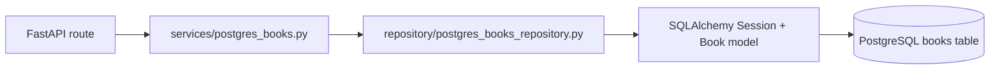

# PostgreSQL Migration Audit

**Current status:** PostgreSQL migration phases 1-7 complete.

**Audit started:** 2026-06-06
**Current CRUD storage:** PostgreSQL `books` table via SQLAlchemy
**Current CRUD flow:** `Route -> Service -> Repository -> SQLAlchemy -> PostgreSQL`
**Legacy CSV compatibility path:** `backend/data/processed/books.csv` and `BOOKS_COLUMNS` in `backend/book_data.py`

---

## Migration Progress

| Phase | Status | Result |
|-------|--------|--------|
| Phase 0: Inventory | Complete | CSV reads/writes, pandas dependencies, API contracts, and migration risks documented |
| Phase 1: Local PostgreSQL Infrastructure | Complete | Docker Compose PostgreSQL, `.env`, `DATABASE_URL`, and `.env.example` added |
| Phase 2: Database Dependencies | Complete | SQLAlchemy, psycopg, Alembic, and python-dotenv added |
| Phase 3: SQLAlchemy Foundation | Complete | `backend/db/database.py`, `SessionLocal`, `get_db()`, `Base`, and `Book` model added |
| Phase 4: Alembic Migrations | Complete | Alembic initialized and initial `books` table migration applied |
| Phase 5: Repository Layer | Complete | PostgreSQL repository CRUD operations implemented and verified |
| Phase 6: API Refactor | Complete | Book CRUD routes now use PostgreSQL-backed services/repository with `get_db()` injection |
| Phase 7: Schema Validation | Complete | Pydantic request validation strengthened and response models added |

Current result:

* PostgreSQL is now the primary storage backend for book CRUD operations.
* Book CRUD operations use PostgreSQL as the source of truth.
* CRUD routes no longer depend on CSV storage.
* Existing API response compatibility is maintained.
* 34 tests are passing.

---

## Phase 6: API Refactor

Completed work:

* Refactored `GET /books` to use the PostgreSQL repository layer.
* Refactored `GET /books/{id}` to use the PostgreSQL repository layer.
* Refactored `POST /books` to use the PostgreSQL repository layer.
* Refactored `PATCH /books` to use the PostgreSQL repository layer.
* Refactored `DELETE /books` to use the PostgreSQL repository layer.
* Added database session injection via `get_db`.
* Preserved existing API response formats.
* Migrated the book import endpoint to PostgreSQL-backed storage.
* Repository layer is now used by book CRUD routes.

Results:

* Book CRUD operations now use PostgreSQL as the source of truth.
* Routes no longer depend on CSV storage for CRUD operations.
* Existing API response compatibility maintained.
* Test suite passing.

---

## Phase 7: Schema Validation

Completed work:

* Reviewed and updated book-related Pydantic schemas.
* Added stronger request validation.
* Added response models.
* Added ORM compatibility via `ConfigDict(from_attributes=True)`.
* Added validation constraints for ratings, page counts, statuses, import requests, and pagination metadata.
* Updated progress status validation.
* Verified compatibility with PostgreSQL-backed routes.

Results:

* Request validation is stricter and more consistent.
* Response models are defined and documented.
* Schemas are compatible with SQLAlchemy ORM models.
* Test suite passing.

---

## Current Book CRUD Path

| Layer | Current responsibility |
|------|------------------------|
| `backend/routes/books.py` | HTTP mapping, query/body validation, `get_db()` session injection, response model declaration |
| `backend/services/postgres_books.py` | Book CRUD use cases, existing response-shape compatibility, business validation |
| `backend/repository/postgres_books_repository.py` | SQLAlchemy CRUD operations for `Book` rows |
| `backend/db/database.py` | Engine, session factory, `get_db()`, declarative base |
| `backend/db/models.py` | `Book` ORM model mapped to `books` table |

---

## Current Endpoint Storage Interaction

| Method | Path | Current storage interaction |
|--------|------|-----------------------------|
| `GET` | `/books` | Reads PostgreSQL books through repository; preserves `{ page, limit, total, results }` shape |
| `GET` | `/books/{book_id}` | Reads PostgreSQL by `isbn_uid` |
| `POST` | `/books` | Creates PostgreSQL `Book` row |
| `PATCH` | `/books` | Updates PostgreSQL `Book` row by legacy title lookup |
| `DELETE` | `/books?title=` | Deletes PostgreSQL `Book` row by legacy title lookup |
| `POST` | `/books/import` | Creates PostgreSQL `Book` rows from parsed import request |
| `POST` | `/books/clear` | Deletes PostgreSQL `Book` rows after confirmation |
| `PATCH` | `/books/{book_id}/progress` | Updates PostgreSQL status/progress fields by `isbn_uid` |
| `DELETE` | `/books/{book_id}` | Deletes PostgreSQL `Book` row by `isbn_uid` |
| `GET` | `/books/export` | CSV compatibility path; returns `text/csv` |
| `GET` | `/recommend?style=` | Recommendation path remains DataFrame-oriented and cached |

Health check is unaffected by storage.

---

## Schema and Validation Status

| Schema | Status |
|--------|--------|
| `AddBook` | Requires non-empty title/author; optional positive total pages |
| `PatchBook` | Validates title, optional metadata, `move_to`, rating, and page constraints |
| `ImportRow` / `ImportBooks` | Requires at least one import row and non-empty titles |
| `BookProgressPatch` | Validates progress status and non-negative pages read |
| `ClearLibraryRequest` | Requires explicit confirmation field |
| `BookResponse` | ORM-compatible via `ConfigDict(from_attributes=True)` |
| `BooksPage` | Validates pagination metadata and result container shape |
| `MessageResponse` / `ImportResult` | Documents common mutation/import responses |

---

## Legacy CSV Inventory

The original Phase 0 audit identified the old live CSV read/write path. That path is no longer the CRUD source of truth, but the inventory remains useful when touching CSV compatibility, export/import, recommendation inputs, or CLI behavior.

### Legacy CSV reads

| File | Function | Current note |
|------|----------|--------------|
| `backend/book_data.py` | `load_data()` | Legacy CSV helper; not used by book CRUD routes |
| `backend/book_data.py` | `ensure_books_file()` | May create headers-only CSV for legacy paths |
| `backend/repository/books_repository.py` | `get_all_books()` | Legacy facade over `load_data()` |
| `backend/services/recommendation.py` | `get_recommendation()` | DataFrame-oriented recommendation path |
| `cli/manage_books.py` | `mark_finished`, `mark_dnf`, `add_to_tbr` | CLI may still use legacy CSV helpers |

### Legacy CSV writes

| File | Function | Current note |
|------|----------|--------------|
| `backend/book_data.py` | `save_data(df)` | Legacy full-file CSV write helper |
| `backend/repository/books_repository.py` | `save_books(df)` | Legacy facade over `save_data()` |
| `backend/services/books.py` | legacy service functions | Not the PostgreSQL-backed CRUD route path |
| `cli/manage_books.py` | CLI mutations | May still write CSV through legacy helpers |

### Batch / offline CSV reads

These read arbitrary user-uploaded CSV files via the ingest pipeline. They do not touch live PostgreSQL storage unless an operator explicitly wires the output into the app.

| File | Function | Purpose |
|------|----------|---------|
| `backend/ingest/load_csv.py` | `load_csv()` | `pd.read_csv(csv)` + column mapping to canonical schema |
| `backend/ingest/pipeline.py` | `validate_uploaded_csv()` | `pd.read_csv(path, nrows=100)` preview for validation gate |

---

## Remaining Follow-up

| Area | Status |
|------|--------|
| SQL-level pagination | Follow-up; response shape already paginated |
| Recommendation data source | Still DataFrame-oriented; can be moved behind a repository adapter later |
| CSV export/import compatibility | Keep response and backup behavior stable |
| CLI storage path | Audit before promising PostgreSQL-backed CLI behavior |
| DB-backed integration tests | Add as repository/service behavior grows |
| Per-user libraries | Requires auth and `library_id` or equivalent ownership model |

---

## Related

- [data-model.md](data-model.md) — field semantics and validation
- [scalability.md](scalability.md) — storage limitations and follow-up work
- [architecture.md](architecture.md) — layer boundaries and repository role
- [decisions.md](../product/decisions.md) — ADR-009 (PostgreSQL-backed book CRUD)
