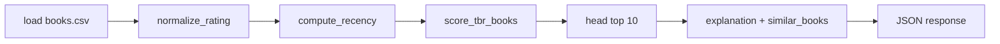

# Recommendation system

## Goal

Help readers choose **what to read next** from their own to-read (TBR) list using signals from books they have **already finished**, with explanations a human can understand.

ShelfTxt does **not** use collaborative filtering across users or external ML APIs. All signals come from **one library** (one CSV today).

---

## Philosophy: rule-based and transparent

Recommendations are **rule-based**:

- Scores are computed from explicit fields (ratings, authors, read dates)
- Formulas live in readable Python (`ranking/`, `preprocess/`)
- Explanations are template strings derived from the same signals—not opaque model outputs

This trades “magic” for **inspectability**, which fits a pre-release tool aimed at readers who want to trust why a book surfaced.

---

## Pipeline (current)



Entry point: `build_recommendations()` in `recommendation_builder.py`, called via cached `get_recommendation(style=...)`.

---

## Scoring inputs

### Used directly in TBR ranking (`score_tbr_books`)

| Input | Source | Role |
|-------|--------|------|
| **Read status** | `Read Status` | Only `to-read` rows are candidates |
| **Author** | `Authors` | Join read-history preference per author |
| **Rating (read books)** | `Star Rating` → `rating_norm` | Mean rating per author on finished books |
| **Global average** | read rows | Fallback when author never read |
| **Random noise** | uniform ±`randomness_strength` | Breaks ties; style-dependent |
| **Author diversity** | dedupe by author | Optional; stronger in discovery style |

### Used in preprocessing (available but secondary for TBR rank)

| Input | Role today |
|-------|------------|
| **Recency** | Computed (`recency_norm`); primary use is in `score_read_books` batch path, not TBR score formula |
| **Progress / pages** | Does not exclude in-progress TBR rows from ranking (still `to-read`) |

### Not used in app CSV ranking today

| Input | Status |
|-------|--------|
| **Genre** | In batch canonical schema only; not in `BOOKS_COLUMNS` |
| **Mood / tags** | Not implemented |
| **External metadata** | Not implemented |

---

## Score formula (TBR)

For each to-read row:

1. Dedupe by `(title, author)` on TBR subset
2. Compute per-author mean `rating_norm` from **read** rows → `author_score`
3. Fill missing author with global mean of read ratings (or 0.5)
4. Add uniform noise in `[-randomness_strength, +randomness_strength]`
5. Clip to [0, 1], sort descending
6. Optionally keep one book per author (`diverse_authors`)

See [Implementation reference](#implementation-reference) for parameter defaults.

---

## Recommendation styles

Query param: `GET /recommend?style=balanced|popular|discovery` (invalid values fall back to `balanced`).

| Style | Ranking behavior | Explanation tone |
|-------|------------------|------------------|
| **balanced** | Default noise (0.05), no author dedupe | Standard author-preference text |
| **popular** | No noise, no author dedupe | Emphasizes known favorite authors |
| **discovery** | Higher noise (0.12), one book per author | Emphasizes new-to-you authors |

Frontend stores style in `localStorage` and passes it on recommend requests.

---

## Response shape

Up to **10** items:

```json
{
  "book": { "id", "title", "author" },
  "score": 0.82,
  "explanation": "Recommended because you have finished…",
  "similar_books": [
    { "id", "title", "author" }
  ]
}
```

### Explanations (user-facing requirements)

Explanations should:

- Reference **observable history** (e.g., finished books by this author)
- Avoid jargon (“embedding”, “model weights”)
- Stay honest when data is thin (global average fallback copy)

Generated in `_explanation()` in `recommendation_builder.py`.

### Similar books

Derived from **finished reads**, not external catalogs:

1. Prefer same author, sorted by rating
2. Fill remaining slots with other highly rated finished books

If the user has no finished books, `similar_books` may be empty.

---

## Caching

`get_recommendation` uses `@lru_cache(maxsize=32)` keyed by `(top_n, style)`.

Cache is cleared on any library mutation via `invalidate_recommendation_cache()` in book services.

**Implication:** repeated GETs are fast; stale results are avoided after writes, not mid-session if another client mutates data (single-user assumption today).

---

## Known limitations

1. **Single-user, single file** — no per-account libraries
2. **Author-only similarity** — no genre/theme graph in live data model
3. **Randomness** — discovery/balanced scores vary between cache misses
4. **Title dedupe on import** — duplicate titles block imports; ranking dedupes TBR by title+author only
5. **No exclusion rules** — cannot “hide” authors or genres yet
6. **In-progress TBR** still ranked alongside untouched TBR
7. **Recency** not weighted into TBR score directly (only via preprocess side effects)
8. **Frontend scoring** (`lib/scoring.ts`) duplicates some display logic for dashboard breakdown—can drift from backend

---

## Future improvements

| Idea | Notes |
|------|-------|
| **Mood-aware recommendations** | Requires `mood_tags` (or similar) on books + reader preference |
| **“Why I added this” context** | Use `why_added` to boost or explain TBR picks |
| **Reading challenge support** | Filter/rank within challenge subsets |
| **Better similar-books copy** | Genre/theme when field exists; “because you liked X” links |
| **Deterministic scoring tests** | Fix random seed in tests; assert order for fixture libraries |
| **Configurable weights** | Expose rating/recency/author weights via settings API |
| **Exclude DNF from negative signal** | Optional down-rank similar authors to DNF titles |

---

## Testing today

- `tests/test_recommendation_builder.py` — structured output smoke test
- `tests/test_api.py` — mocks `get_recommendation` for HTTP contract

Gap: few tests assert exact rank order with fixed random seed. See [scalability.md](scalability.md).

---

## Implementation reference

Scoring implementation: `backend/ranking/score.py`  
Normalization: `backend/preprocess/normalize.py`  
HTTP orchestration: `backend/services/recommendation_builder.py`

### Feature normalization

#### `normalize_rating(df)`

Column: `Star Rating` or `rating`.

- Coerce numeric; fill NaN with column mean (or 0.5 if all missing)
- Min–max → `rating_norm` in [0, 1]

#### `compute_recency(df)`

Column: `Last Date Read` or `last_date_read`.

- `days_since_read` = days from finish date to today
- `recency_norm` = min–max reversed (more recent → higher)
- Default 0.5 when no dates

### Read books: `score_read_books`

Filter: `Read Status` == `read`

```text
score = 0.7 × rating_norm + 0.3 × recency_norm
```

Used in batch pipeline output. **Not** the primary HTTP recommendation path today.

### TBR books: `score_tbr_books`

Filter: `Read Status` == `to-read`

1. Dedupe `(title, author)` on TBR rows
2. Mean `rating_norm` per author from **read** rows → `author_score`
3. Left join onto TBR; fill unknown authors with global read average (or 0.5)
4. Add uniform noise ± `randomness_strength` (default 0.05)
5. Clip to [0, 1], sort descending
6. Optional: one book per author (`diverse_authors`)

| Parameter | Default | Effect |
|-----------|---------|--------|
| `randomness_strength` | 0.05 | Score jitter |
| `diverse_authors` | True in discovery style | Author diversity |

### Recommendation style parameters

Applied in `recommendation_builder._rank_tbr_for_style`:

| Style | `randomness_strength` | `diverse_authors` |
|-------|----------------------|-------------------|
| `balanced` | 0.05 | false |
| `popular` | 0.0 | false |
| `discovery` | 0.12 | true |

Query: `GET /recommend?style=balanced|popular|discovery`

### HTTP response pipeline

`build_recommendations(df, top_n=10, style)`:

1. Normalize + score TBR
2. Take top 10
3. Attach `explanation` (template from author history)
4. Attach `similar_books` (up to 3 finished reads, same author preferred)

Cached in `get_recommendation()` (`@lru_cache`, per style). Invalidated on book writes.

### Legacy: `recommend_one`

Samples one random book from top 5 TBR rows. **Not used** by current `GET /recommend` (returns top 10 structured list instead).

### Column resolution

`_resolve_column(df, candidates)` maps app columns (`Title`, `Read Status`) and canonical columns (`title`, `read_status`).

### Storage

Scores and normalized features are **computed in memory** — not written back to `books.csv`.

| Call site | Functions |
|-----------|-----------|
| `GET /recommend` | normalize → score_tbr → build explanations |
| Batch pipeline | above + `score_read_books` |

---

## Related code

| File | Role |
|------|------|
| `backend/ranking/score.py` | Core TBR/read scoring |
| `backend/preprocess/normalize.py` | Feature normalization |
| `backend/services/recommendation_builder.py` | HTTP-facing bundle |
| `backend/services/recommendation.py` | Cache + style normalization |
| `frontend/src/lib/scoring.ts` | Client-side breakdown for dashboard (display) |
