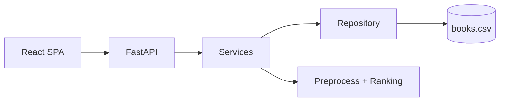

# System Design (1-Page)

Interview-style summary of Shelftxt system design.

---

## Problem

Users need a transparent way to manage a personal reading list and get explainable “what to read next” recommendations.

---

## Requirements

### Functional

- CRUD books (`/books`)
- Bulk import (`/books/import`)
- Recommend next reads (`/recommend`)
- Provide rationale signals (author/rating/recency factors)

### Non-functional

- Simple local developer setup
- Low operational cost
- Fast response for personal library sizes
- Clear separation of concerns to support future DB migration

---

## High-level architecture

---

## Data flow

1. UI requests `/recommend`.
2. API service loads books via repository.
3. Preprocess computes normalized features.
4. Ranking computes scores and ordered candidates.
5. API returns JSON-safe records.

Writes (`POST/PATCH/import`) persist to CSV and invalidate recommendation cache.

---

## Storage model

- Current source of truth: CSV (`backend/data/processed/books.csv`)
- Access path: `repository -> book_data.py`
- Trade-off: low complexity now, limited concurrency and write scale later

---

## Scaling strategy

### Now

- Monolith API + CSV + in-process cache

### Next

- Replace CSV with PostgreSQL behind repository interface
- Introduce stable IDs for mutation paths
- Add shared cache if running multiple API instances

---

## Reliability & security

- Health checks (`/health`)
- Input validation via Pydantic
- Cache invalidation after writes
- Current model assumes trusted/single-user usage (auth pending)

---

## Main trade-offs

- **Monolith over microservices:** faster iteration, less infra
- **Rule-based ranking over ML model:** explainability over model complexity
- **CSV over DB:** low ops overhead over scalability

---

## Risks

- Title-keyed mutations can collide
- CSV rewrite costs grow with scale
- Cache coherence issues in multi-instance deployments

Mitigation path: stable IDs + DB migration + shared cache.
