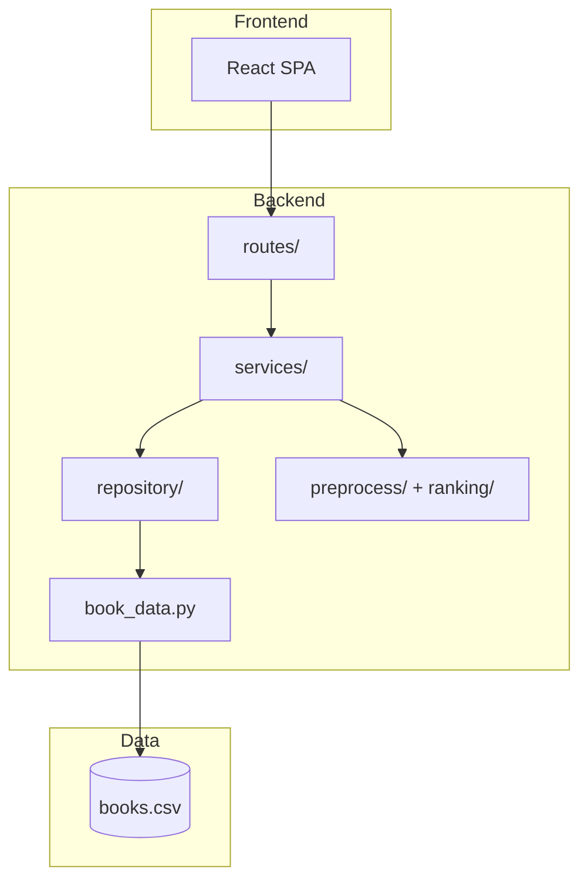

# RFC: Shelftxt System Design

- **Status:** Draft
- **Authors:** Shelftxt maintainers
- **Last updated:** 2026-05-27
- **Related:** [system-design.md](system-design.md), [architecture.md](../architecture.md), [decisions.md](../decisions.md)

---

## 1. Context

Shelftxt is a recommendation-first reading tracker. The system prioritizes explainability and development velocity while preserving a migration path to stronger persistence and scalability primitives.

Current implementation is a monorepo monolith:

- React SPA (`frontend/`)
- FastAPI backend (`backend/`)
- CSV persistence (`backend/data/processed/books.csv`)

---

## 2. Scope

This RFC defines:

- Current architecture and behavior
- Explicit boundaries between layers
- Reliability, performance, and security posture
- Migration plan and rollout risks

Out of scope:

- Final auth design
- Full analytics platform design
- ML-serving architecture

---

## 3. Design goals

1. **Explainability first:** recommendation outputs should be interpretable.
2. **Low ops complexity:** local-first workflows and inexpensive hosting.
3. **Modular boundaries:** layering that supports storage and cache evolution.
4. **Safe iteration:** ability to ship frontend/backend features quickly without breaking recommendation behavior.

---

## 4. Architecture

### Layer contracts

- `routes`: HTTP concerns only (validation, request/response shape, status codes)
- `services`: use-case orchestration and business rules
- `repository`: persistence abstraction
- `book_data`: concrete storage format and coercion
- `preprocess`/`ranking`: pure transforms/scoring (no I/O)

---

## 5. API behavior

Core endpoints:

- `GET /books`
- `POST /books`
- `PATCH /books`
- `POST /books/import`
- `GET /recommend`
- `POST /recommend/refresh`
- `GET /health`

### Expected semantics

- Mutations update storage and invalidate recommendation cache.
- Recommendation response may include derived fields (`score`, `author_score`, normalized signals).
- Error semantics are explicit for invalid transitions (e.g., bad shelf move, missing title).

---

## 6. Recommendation pipeline

1. Load library rows.
2. Split read vs to-read cohorts.
3. Compute normalized features (`rating_norm`, `recency_norm`).
4. Apply weighted scoring for TBR candidates.
5. Return ordered recommendations; dashboard/detail pages compute readable explanation blocks.

Design intent:

- Stable enough for user trust
- Flexible enough to iterate with new factors

---

## 7. Data model

Primary persisted columns include:

- Identity/metadata: `Title`, `Authors`, `ISBN/UID`
- State: `Read Status`, `Progress (%)`, `Pages Read`, `Total Pages`
- History: `Star Rating`, `Last Date Read`

Current caveat:

- Some mutation paths are title-keyed. This is practical but not ideal for collision safety.

---

## 8. Reliability model

### Today

- Process liveness via `/health`
- In-process recommendation caching
- Cache invalidation on writes
- Unit tests for API and ranking/pipeline paths

### Failure modes

- Port collisions during local dev startup
- CSV contention/overwrite risks with concurrent writes
- Cache mismatch if multiple API instances are introduced without shared cache

---

## 9. Security model

### Current

- CORS configured in backend app
- Schema validation on write payloads
- No auth (trusted single-user workflow)

### Planned

- Authentication and authorization
- Rate limiting
- Better operational logging for auditability

---

## 10. Performance considerations

Observed expected behavior:

- Reads and ranking are fast for small/medium personal datasets.
- Full-file rewrites make write throughput the principal scaling boundary.

Optimization opportunities:

- Incremental persistence strategy via DB
- Shared cache and cache TTL strategy
- Background recomputation for expensive recommendation enrichment

---

## 11. Migration plan

### Phase A: Stability hardening

- Keep repository contract strict
- Expand tests around mutation edge cases and recommendation explanation consistency

### Phase B: Persistence migration

- Introduce PostgreSQL-backed repository implementation
- Add stable record IDs
- Keep route/service signatures compatible where possible

### Phase C: Scale features

- Shared cache (Redis) for multi-instance API
- Optional job queue for heavy recompute tasks
- Observability improvements (structured logs, traces, dashboards)

---

## 12. Alternatives considered

1. **Microservices split now**
   - Rejected: operational overhead too high for current scope.
2. **ML-first ranker**
   - Rejected: reduced explainability and higher complexity.
3. **DB-first from day one**
   - Rejected: slower early velocity; CSV acceptable at present scale.

---

## 13. Open questions

- When to enforce stable IDs across all write APIs?
- What recommendation metrics should be tracked in production first?
- Should recommendation cache be TTL-based, event-based, or hybrid after DB migration?

---

## 14. Acceptance criteria

- Documentation reflects current architecture and layer ownership.
- Migration path from CSV to DB is explicit and actionable.
- Known limitations and risks are clear to contributors.

