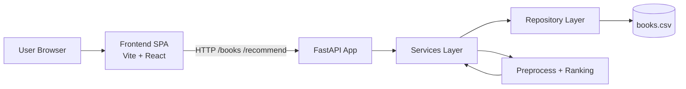

# System Design

Comprehensive design reference for Shelftxt: architecture, data flow, scaling strategy, reliability, and operational boundaries.

---

## 1) Goals and non-goals

### Goals

- Provide a transparent recommendation workflow for TBR books.
- Keep the product simple to run locally and cheap to host.
- Maintain clear backend layering (`routes -> services -> repository -> persistence`).
- Support incremental evolution from CSV persistence to PostgreSQL.
- Keep recommendation logic inspectable and deterministic enough for debugging.

### Non-goals (current phase)

- Real-time collaborative editing.
- Multi-tenant auth/permissions.
- Heavy ML infrastructure (feature stores, online inference services).
- Hard consistency guarantees across distributed services (single service today).

---

## 2) High-level architecture

Shelftxt is a monorepo monolith with one primary API service and one SPA frontend.



### Deployment shape

- **Frontend:** static app served by Vercel (production) or Vite dev server (local).
- **Backend:** FastAPI served via Uvicorn on Render (production) or localhost (local).
- **Persistence:** CSV file (`backend/data/processed/books.csv`) managed by backend code.

---

## 3) Component responsibilities

| Component | Responsibility | Constraints |
|-----------|----------------|------------|
| `frontend/` | Present ranking, detail explainability, book management flows | Should not contain ranking business logic |
| `backend/routes/` | HTTP parsing, response codes, schema validation | Keep thin, no heavy domain logic |
| `backend/services/` | Use-case orchestration (add/update/import/recommend) | No direct UI or rendering concerns |
| `backend/repository/` | Persistence abstraction (`get_all_books`, `save_books`) | No ranking logic |
| `backend/book_data.py` | CSV schema + I/O + type coercion | No HTTP concerns |
| `backend/preprocess/` | Feature normalization (`rating_norm`, `recency_norm`) | Pure data transforms |
| `backend/ranking/` | Recommendation scoring and ranking | No file/network I/O |

---

## 4) Request and data flows

### A. Read ranked recommendations

1. Frontend calls `GET /recommend`.
2. Route delegates to recommendation service.
3. Service loads current library through repository.
4. Preprocess + ranking modules compute features/scores.
5. Service returns JSON-safe rows (NaN normalized to `null`).

### B. Add a single book

1. Frontend submits `POST /books`.
2. Service validates business rules, appends row, saves CSV.
3. Recommendation cache is invalidated.
4. Next `GET /recommend` recomputes from latest data.

### C. Bulk import

1. Frontend parses CSV client-side.
2. Frontend posts normalized rows to `POST /books/import`.
3. Service de-duplicates by title and writes accepted rows.
4. API returns `{ imported, skipped }`.

---

## 5) Data model summary

Primary app schema (CSV-backed):

- `Title`, `Authors`, `ISBN/UID`
- `Read Status` (`to-read`, `read`, `dnf`, with reading inferred from progress)
- `Star Rating`, `Last Date Read`
- `Progress (%)`, `Pages Read`, `Total Pages`
- Derived runtime recommendation fields like `score`, `author_score`, `rating_norm`, `recency_norm`

Design notes:

- Current write key is title-based for several mutations.
- Recommendation fields are computed on read path and not persisted as source of truth.

---

## 6) Caching and consistency

- Recommendation responses use an in-process cache for cheaper repeated reads.
- Mutating operations clear recommendation cache after successful writes.
- Consistency model is read-after-write within a single backend process.
- CSV persistence implies file-level write operations; concurrency guarantees are limited.

---

## 7) Reliability and observability

### Current protections

- Health endpoints (`/`, `/health`) for liveness checks.
- Explicit error responses from services for invalid transitions.
- Automated tests for API behavior and pipeline behavior.

### Current limitations

- No distributed tracing.
- Minimal structured logging.
- CSV persistence is vulnerable to file contention under high concurrent writes.

---

## 8) Security posture (current)

- CORS configured in backend app.
- No user auth yet; API is designed for single-user / trusted usage model.
- Input validation enforced with Pydantic schemas.
- No secrets stored in frontend bundle (backend base URL is public by design).

Future security milestones:

- Authentication and scoped access control.
- Request throttling / abuse controls.
- Audit logging for write operations.

---

## 9) Performance profile

Expected current profile:

- Fast reads/writes for small to medium personal libraries.
- Recommendation latency largely bound by in-memory DataFrame operations.
- Single-process app is adequate for current product scale.

Potential bottlenecks:

- CSV I/O and whole-file rewrites on frequent writes.
- In-process cache invalidation does not coordinate across multiple workers.

---

## 10) Scaling plan

### Phase 1 (now)

- Monolith + CSV + in-process cache.
- Keep route/service boundaries strict to preserve migration path.

### Phase 2

- Move persistence behind PostgreSQL while keeping repository contract stable.
- Introduce transactional writes and indexed lookup keys.
- Add migration for title-keyed operations to durable IDs.

### Phase 3

- Optional external cache (Redis) for shared recommendation cache.
- Optional async background jobs for expensive recomputation paths.

---

## 11) Key trade-offs

| Decision | Benefit | Cost |
|----------|---------|------|
| CSV as source-of-truth | Very low ops overhead, easy local debugging | Limited concurrent write safety and scale |
| Monolith architecture | Fast iteration, low cognitive load | Fewer independent scaling knobs |
| Transparent rule-based ranking | Explainable and inspectable outputs | Less expressive than advanced ML ranking |
| In-process cache | Simple and fast | Cache coherence issues in multi-instance setups |

---

## 12) Operational runbook (local)

```bash
# backend
source .venv/bin/activate
uvicorn backend.api:app --reload

# frontend
cd frontend
npm run dev
```

Verification checks:

- API docs: `http://127.0.0.1:8000/docs`
- Health: `http://127.0.0.1:8000/health`
- Frontend: `http://localhost:3000`

---

## 13) Open design risks

- Title-as-key can lead to collisions/rename complexity.
- CSV file writes may become a bottleneck with higher write frequency.
- Feature definitions and explanation text may drift from implementation without strict tests.

Mitigations:

- Introduce stable IDs for all mutations.
- Move to DB-backed repository with migrations.
- Add contract tests for recommendation factors and explanations.

---

## 14) Related docs

- [architecture.md](../architecture.md)
- [architecture/system-overview.md](../architecture/system-overview.md)
- [ranking.md](../ranking.md)
- [api.md](../api.md)
- [decisions.md](../decisions.md)
