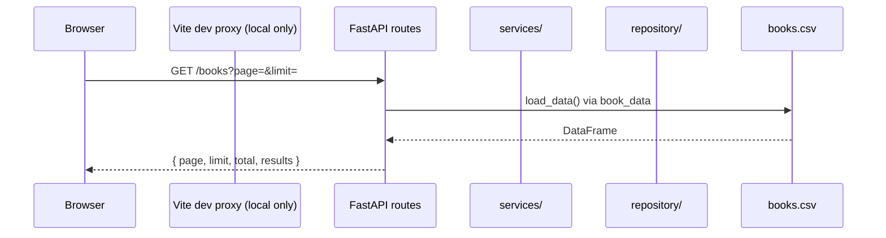
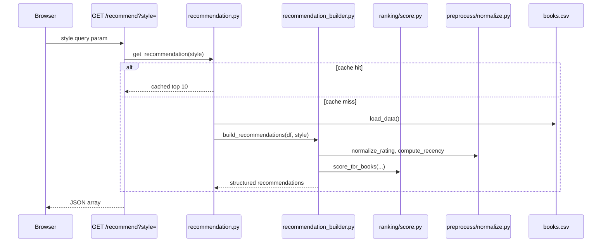
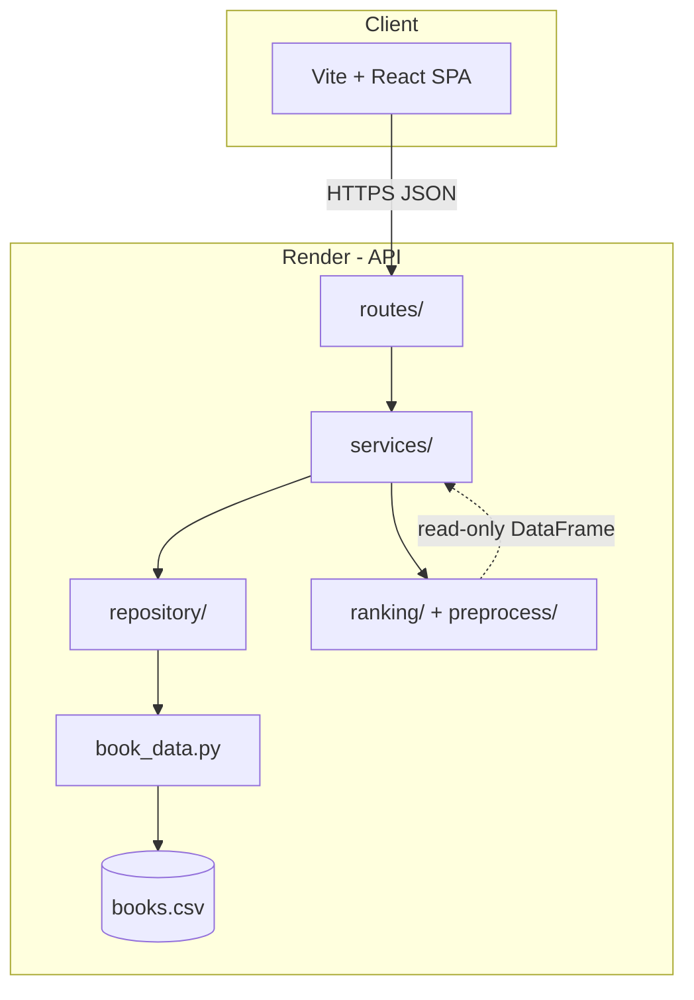

# Architecture overview

## High-level summary

ShelfTxt is a **monorepo** with three runnable surfaces that share one logical library:

| Surface | Stack | Role |
|---------|-------|------|
| **Web UI** | Vite, React 19, TypeScript, Tailwind CSS | Reader-facing library, progress, recommendations, settings |
| **REST API** | FastAPI, pandas, Pydantic | CRUD, import/export, recommendation orchestration |
| **CLI** | Python (`cli/manage_books.py`) | Local shelf edits (limited commands today) |
| **Batch pipeline** | Python (`backend/ingest/`) | Offline CSV mapping to canonical schema—not used by live UI import |

**Persistence today:** a single CSV file at `backend/data/processed/books.csv`, accessed through `backend/book_data.py` and wrapped by `backend/repository/books_repository.py`.

**Production hosts (as of current deployment):**

- Frontend: Vercel (`shelftxt.vercel.app`)
- API: Render (`shelftxt.onrender.com`)

---

## Main components

### Frontend

- SPA under `frontend/src/`
- Routes: Dashboard, Library, Recommendations, Book detail, Add book, Insights, Settings
- Calls the API via `frontend/src/lib/api.ts` (direct to Render in production; Vite proxy `/api/*` in local dev)
- Reader preferences (recommendation style, theme, accent) stored in **browser `localStorage`** — not synced to the backend today

### FastAPI backend

- Entry: `backend/api.py` — CORS, lifespan (keep-warm ping), router registration
- HTTP handlers: `backend/routes/` — thin; delegate to services
- Business logic: `backend/services/` — shelf mutations, import/export, recommendation cache
- Validation: `backend/schemas/` — Pydantic request bodies

### Book data storage layer

- `backend/book_data.py` — load/save CSV, column normalization on read
- `backend/repository/books_repository.py` — thin facade (`get_all_books`, `save_books`) intended for future DB swap

### Recommendation / ranking logic

- **Preprocess:** `backend/preprocess/normalize.py` — `rating_norm`, `recency_norm`
- **Ranking:** `backend/ranking/score.py` — TBR scoring via author preference from read history
- **Orchestration:** `backend/services/recommendation_builder.py` — top-N list, explanations, similar books
- **Cache:** `backend/services/recommendation.py` — `@lru_cache` keyed by recommendation style

Ranking modules perform **no I/O**; they receive DataFrames from services.

### CSV import / export

- **UI import:** browser parses CSV → JSON → `POST /books/import`
- **Export:** `GET /books/export` returns full library CSV
- **Batch ingest:** separate Python pipeline for arbitrary external CSV schemas ([pipeline.md](../pipeline.md))

---

## Request / response flow (typical read)

## Request / response flow (recommendation)

Mutations (add, patch, progress, delete, import, clear) go through `services/books.py`, persist via repository, then call `invalidate_recommendation_cache()`.

---

## System context diagram

---

## Layer boundaries

| Layer | Responsibility | Should not |
|-------|----------------|------------|
| **UI** | Display library, collect edits, explain recommendations to readers | Implement scoring rules or persist data locally (except UI-only prefs) |
| **Routes** | HTTP mapping, status codes, JSON/CSV response shapes | Contain shelf transition branching or ranking math |
| **Services** | Use cases: add book, update progress, build recommendations | Know about React or Vite |
| **Repository** | Load/save abstraction | Rank or validate HTTP bodies |
| **book_data** | CSV file I/O, column repair | Business rules for shelf states |
| **ranking / preprocess** | Pure transforms on DataFrames | Read files or call HTTP |

### Known boundary gaps (current)

- `GET /books` loads the full CSV via `load_data()` in the route, then slices for `page`/`limit` — wire-level pagination only until PostgreSQL; repository use remains a minor inconsistency.
- `backend/api_draft.py` exists as legacy reference; **not** mounted by `uvicorn backend.api:app`.
- Title remains a lookup key for `PATCH /books` and `DELETE /books?title=`; book id (`ISBN/UID`) is preferred for progress and delete-by-id from the UI.

---

## Deployment notes

See [deployment.md](../deployment.md). Render runs a periodic self-ping to `/health` to reduce cold starts on free tier. CSV on Render filesystem may not survive redeploys—documented as an operational limitation in [scalability-and-limitations.md](./scalability-and-limitations.md).
