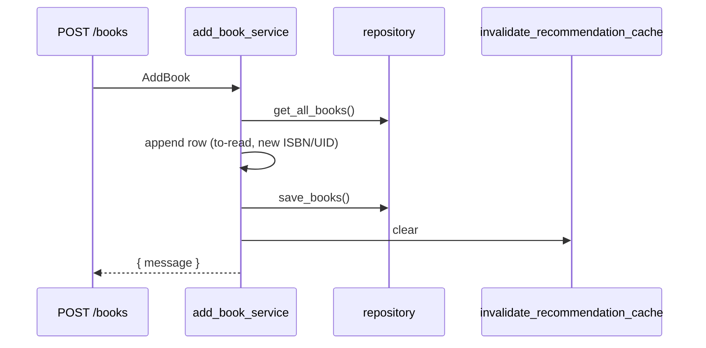
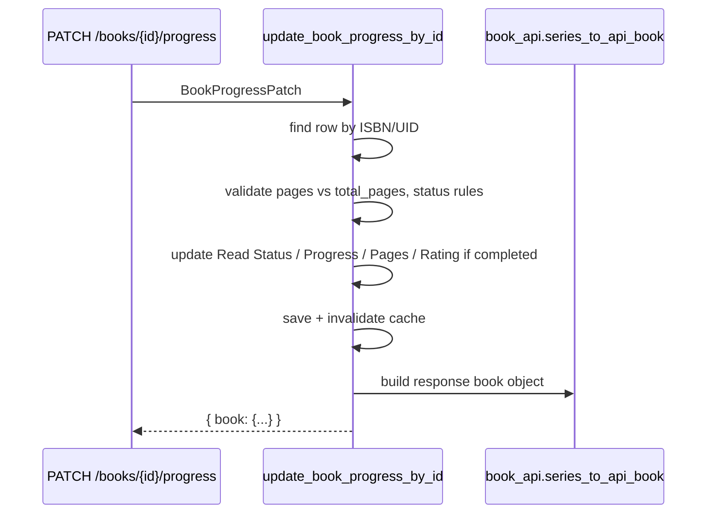
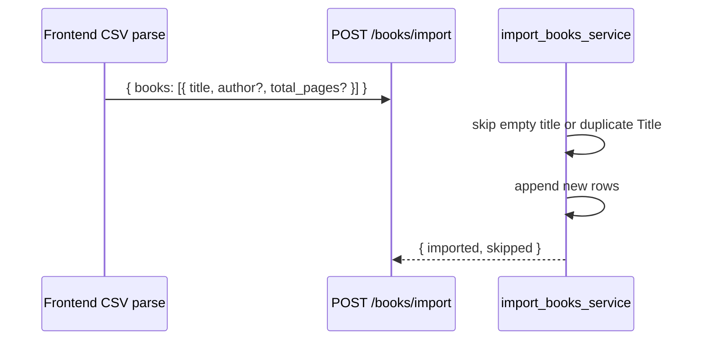
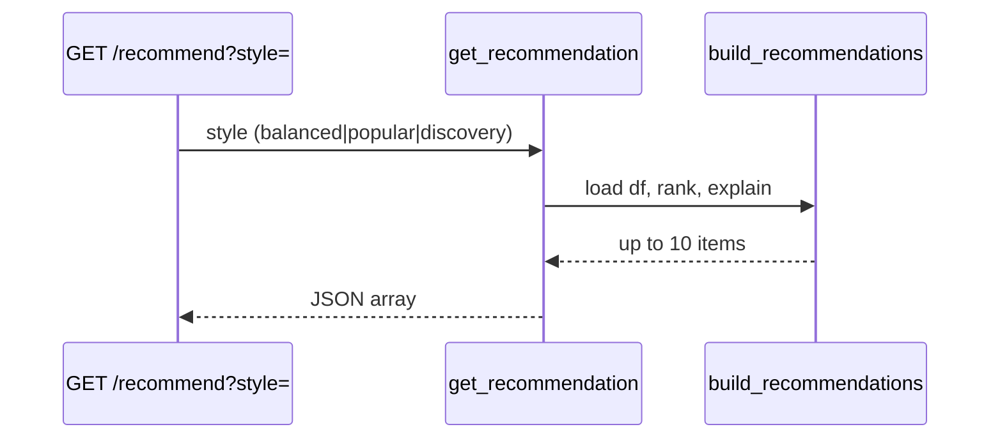

# Backend design

## Folder structure (backend/)

```text
backend/
├── api.py                 # FastAPI app, CORS, lifespan, router includes
├── book_data.py           # CSV load/save, BOOKS_COLUMNS
├── routes/
│   ├── health.py          # GET/HEAD /health
│   ├── books.py           # /books, import, export, clear, progress, delete by id
│   └── recommendation.py  # GET /recommend
├── schemas/
│   └── books.py           # Pydantic models for request bodies
├── services/
│   ├── books.py           # Shelf CRUD, import/export/clear, progress updates
│   ├── book_api.py        # Row → API book dict, find by ISBN/UID
│   ├── recommendation.py  # Cached get_recommendation()
│   └── recommendation_builder.py  # Top-N + explanations + similar books
├── repository/
│   └── books_repository.py
├── preprocess/
│   └── normalize.py       # rating_norm, recency_norm
├── ranking/
│   └── score.py           # score_tbr_books, score_read_books, recommend_one
└── ingest/                # Offline batch pipeline (not live UI import)
```

---

## Responsibilities by layer

### API routes (`backend/routes/`)

- Map HTTP verbs and paths to service functions
- Serialize responses (JSON arrays, CSV download, `NaN` → `null` for JSON)
- Stay thin: no shelf state machines, no scoring formulas

**Example:** `PATCH /books/{book_id}/progress` validates body via Pydantic, calls `update_book_progress_by_id`.

### Services (`backend/services/`)

- Own business rules: shelf transitions, progress validation, duplicate skipping on import
- Call repository for persistence
- Invalidate recommendation cache after mutating writes
- Compose ranking/preprocess for recommendations

### Schemas (`backend/schemas/`)

- Request validation at the HTTP boundary
- Models today: `AddBook`, `PatchBook`, `ImportBooks`, `BookProgressPatch`, `ClearLibraryRequest`

Response bodies are mostly plain dicts or DataFrame-derived records—not always wrapped in response schemas yet.

### Repository / data access

- `books_repository.py`: `get_all_books()`, `save_books(df)`, helpers
- Underlying I/O: `book_data.load_data()` / `save_data()`
- Intended swap point for PostgreSQL or similar without changing route signatures

### Ranking / recommendation modules

- **Pure functions** on pandas DataFrames
- `score_tbr_books` — ranks `to-read` rows using author preference from `read` rows
- `score_read_books` — ranks finished books (used in batch pipeline; not primary HTTP path today)
- `recommendation_builder.build_recommendations` — HTTP-facing structured output

---

## Why business logic stays out of route handlers

1. **Testability** — services are unit-tested with mocked `get_all_books` / `save_books` without HTTP clients.
2. **Reuse** — CLI and future jobs can call the same functions as the API.
3. **Cache invalidation** — one place (`services/books.py`) clears recommendation cache after writes.
4. **Evolution** — swapping CSV for a database affects repository + services, not every route.

Route handlers should read like: validate input → call service → return result.

---

## Flows

### Add book



### Update progress (UI primary path)



Status mapping in API response (`not_started` | `reading` | `completed`) is computed in `book_api.py`, not stored as separate CSV columns.

### Patch shelf (legacy / advanced)

`PATCH /books` with `move_to`: `want` | `reading` | `read` | `dnf` — keyed by **title**. Still supported; UI primarily uses progress endpoint for status.

### Import books



### Export library

`GET /books/export` → `export_library_csv()` → raw CSV string with `Content-Disposition` attachment.

### Clear library

`POST /books/clear` with `{ "confirm": true }` → empty DataFrame with headers → save.

### Delete book

- `DELETE /books/{book_id}` — used by UI (`ISBN/UID`)
- `DELETE /books?title=` — title query param (legacy)

### Recommendations



---

## Error handling conventions

- **404** — book not found (title or id)
- **400** — validation failures (progress exceeds total pages, clear without confirm, read without rating on legacy patch, etc.)
- FastAPI/Pydantic **422** — malformed JSON or invalid enum values on request bodies

Errors typically return `{ "detail": "message" }`. Frontend `fetchJson` surfaces `detail` to the user when present.

---

## Legacy and to confirm

| Item | Status |
|------|--------|
| `backend/api_draft.py` | Legacy monolith; not loaded in production |
| `recommend_one()` in `score.py` | Used in older single-pick flow; HTTP now uses top-10 builder |
| Genre in app CSV | Not in `BOOKS_COLUMNS`; batch pipeline supports genre separately |
| Auth / multi-user | Not implemented |
