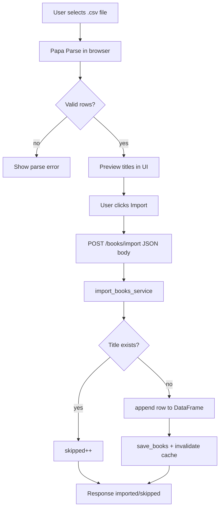
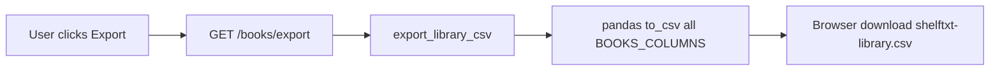

# Import and export flow

ShelfTxt supports two related but **separate** CSV paths:

1. **Live UI import / API export** — what readers use in Settings
2. **Batch ingest pipeline** — developer/offline tool for foreign CSV schemas

This document covers **(1)** in depth and references **(2)** where it diverges.

---

## CSV import (UI + API)

### Purpose

Bulk add books to the TBR shelf without manual entry—typical after exporting from a spreadsheet or another tool (with compatible columns).

### Flow



### Expected CSV fields (UI parser)

The frontend accepts flexible header names:

| Logical field | Accepted headers |
|---------------|------------------|
| Title | `title`, `Title` |
| Author | `author`, `Author` |
| Total pages | `total_pages`, `Total Pages` |

**Minimum:** at least one row with a non-empty title.

Optional fields in the file beyond these three are **ignored** by UI import—not written to `books.csv`.

### API request shape

After client parsing:

```json
{
  "books": [
    { "title": "Dune", "author": "Frank Herbert", "total_pages": 688 }
  ]
}
```

### Server behavior (`import_books_service`)

For each row:

1. Strip title; skip if empty → `skipped`
2. Skip if `Title` already in library (case-sensitive) → `skipped`
3. Append row:
   - `Read Status` = `to-read`
   - `Progress (%)` = 0, `Pages Read` = 0
   - `ISBN/UID` = timestamp-based unique string
   - `Authors` = provided or `"Unknown"`
   - `Star Rating`, `Last Date Read` = empty

If `imported > 0`: save and invalidate recommendation cache.

### Response

```json
{ "imported": 5, "skipped": 2 }
```

---

## CSV export

### Purpose

Backup, migration, editing in Excel/Sheets, or re-import elsewhere.

### Flow



### Exported fields

All columns from `BOOKS_COLUMNS`:

`Title`, `Authors`, `ISBN/UID`, `Read Status`, `Star Rating`, `Last Date Read`, `Progress (%)`, `Pages Read`, `Total Pages`

Export includes **full library state**, not only TBR.

---

## Validation and cleanup

| Stage | Behavior |
|-------|----------|
| Client parse | Papa Parse errors surfaced in Settings UI |
| Client normalize | Invalid/missing pages → `null`; skip rows without title |
| Server import | Pydantic validates JSON shape; per-row skip logic |
| Server load (any read) | Missing columns added; status lowercased; dates coerced |

Invalid star ratings in a hand-edited CSV may survive load but affect normalization at recommend time (`errors="coerce"` paths).

---

## Handling missing or invalid fields

| Field missing on import | Result |
|-------------------------|--------|
| title | Row skipped (client) or skipped (server if empty) |
| author | `"Unknown"` |
| total_pages | `null` — user must set before progress tracking |

| Field missing on export row | Result |
|-----------------------------|--------|
| Any column | Still present in header; value empty/null |

---

## Backward compatibility

- Export → edit → re-import: **duplicate titles skipped**, not updated. Re-import is additive only.
- To “update” existing rows, use UI progress editor or `PATCH` endpoints—not import.
- Preserving `ISBN/UID` on re-import is **not** supported through UI import (new ids assigned for new titles only).
- Batch pipeline can map `Genre` and other fields into canonical form but does not automatically merge into live CSV unless operated separately ([pipeline.md](../pipeline.md)).

---

## Clear library (related)

`POST /books/clear` with confirm resets CSV to headers-only. Distinct from export; irreversible without a backup file.

---

## Batch ingest pipeline (offline)

| Aspect | UI import | Batch pipeline |
|--------|-----------|----------------|
| Entry | Settings / API | `backend/ingest/pipeline.py` |
| Input | JSON from parsed CSV | File path + mapping JSON |
| Schema | App columns only | Canonical schema + genre |
| Writes live CSV | yes | only if operator saves output to processed path |

Do not conflate the two when documenting user-facing behavior.

---

## Testing

- `tests/test_api.py` — import duplicate skip, import without save when zero added
- Manual: round-trip export → inspect headers → import new titles only

Gap: no automated test for UI Papa Parse mapping (client-only).
